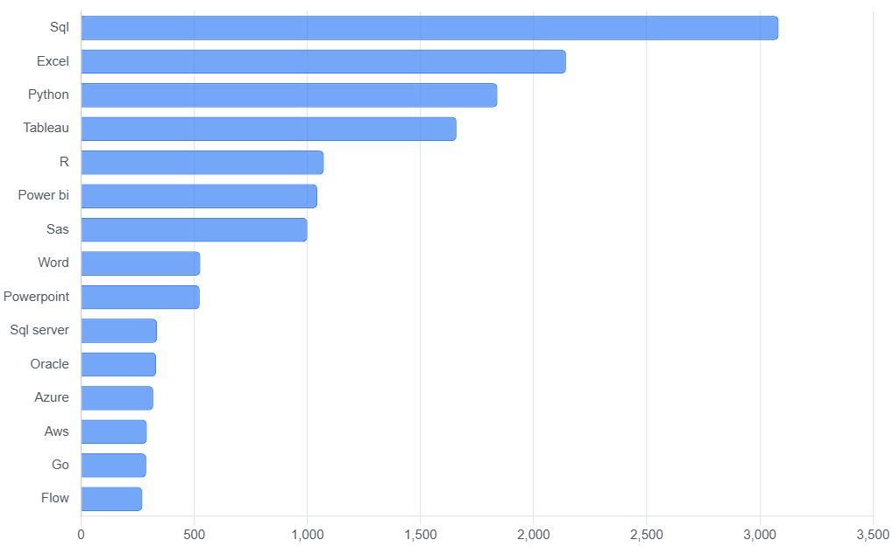
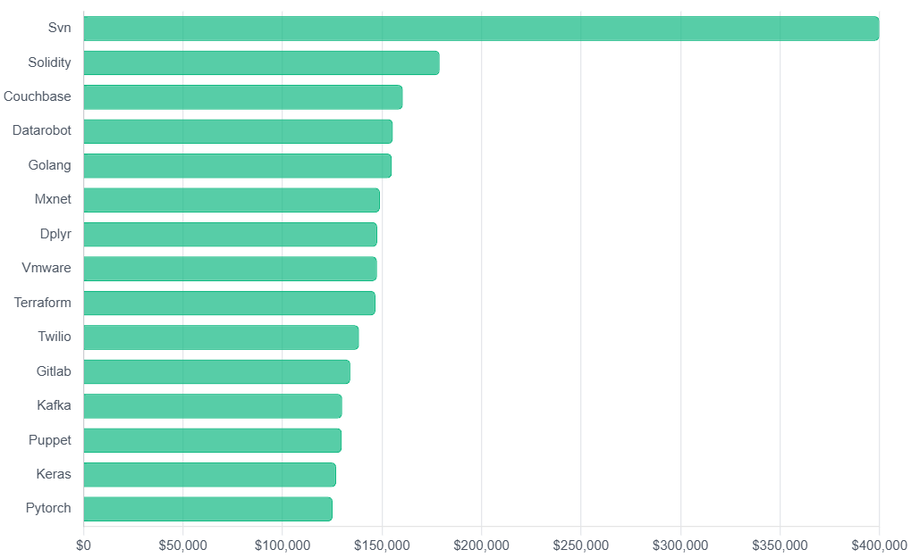
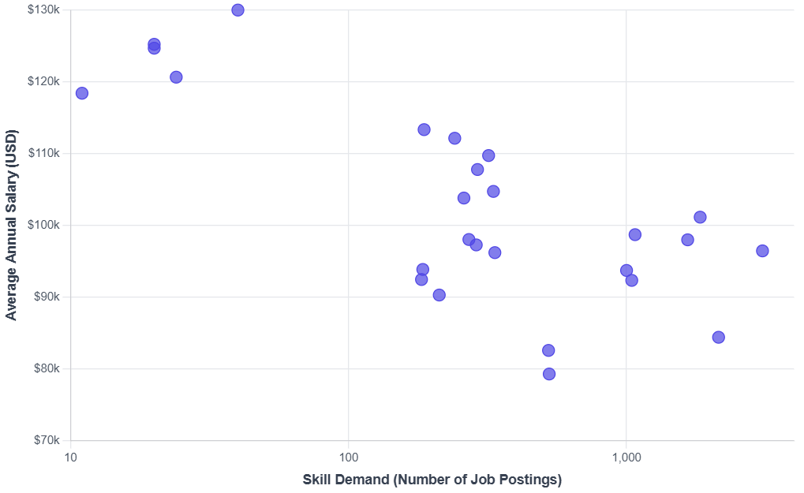

# Data Analytics Project (Job Postings Fact)

Hello there!
This is my sample project to analyze the dataset of job postings fact using PostgreSQL.

From the dataset, i will summarize the information i got into some insights i.e. Most-demand skills, Most-paying skills and Most-optimal skills.

## Most-demand Skills
There are several skills on-demand that you need to be Data Analyst, below is the most-demand skills according to the dataset:

## Most-paying Skills
There are several skills that make you get higher salary in Data Analyst job, below are the top-paying skills in Data Analytics jobs:

## Most-optimal Skills
We can't get the same skills that high salary and high demand simultaneously. Becase from the results above, the difficult skills will get higher salary, but the amount of demand is not high. Otherwise, the easier skills pay lower, but have the demand in some companies. 
So, below are the most-optimal (high demand and high salary, sorted by salary descendent firstly) skills you need to learn!

Link to dataset: https://drive.google.com/drive/folders/1moeWYoUtUklJO6NJdWo9OV8zWjRn0rjN
Click here to get interactive chart --> index.html
